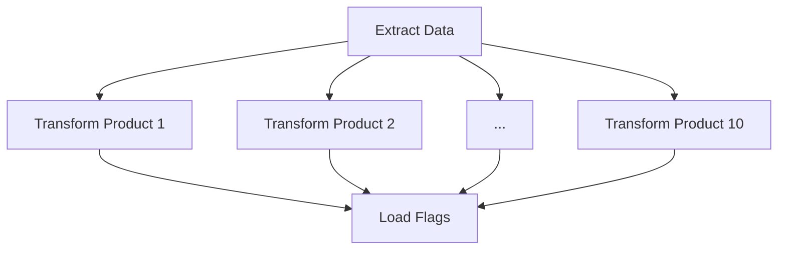

[RU-version](https://github.com/Halacky/eng_data_airflow/blob/main/README-ru.md)

[EN-version](https://github.com/Halacky/eng_data_airflow/blob/main/README-en.md)


# ETL Process for Customer Activity Flags in Apache Airflow

## Project Overview 📊

This project implements an automated ETL pipeline for calculating customer activity flags based on transaction data using Apache Airflow. The solution provides monthly insights into customer engagement across 10 different products.

### Key Features ✨
- **Automated monthly processing** (runs on the 5th of each month)
- **Parallel product processing** for optimal performance
- **Incremental data updates** preserving historical records
- **Clear visual indicators** of customer activity status

## Technical Implementation 🛠️

### Pipeline Architecture


### Data Flow
1. **Extract** (CSV source) → 2. **Transform** (Activity calculation) → 3. **Load** (CSV destination)

## Getting Started 🚀

### Prerequisites
- Docker & Docker Compose installed
- 4GB+ available memory for containers

### Installation
```bash
# Initialize the environment and start services
./init.sh
```

### Accessing Airflow
🌐 Open your browser to: [http://localhost:8080](http://localhost:8080)

🔑 Credentials:
- Username: `admin`
- Password: (Check terminal output after init.sh or .env file)

## Pipeline Details 🔍

### Scheduled Execution
- Automatic trigger: **Monthly on the 5th**
- Manual trigger: Available via Airflow UI

### Task Breakdown
| Task Name | Description | Parallelism |
|-----------|-------------|-------------|
| `extract_data` | Reads source CSV data | Sequential |
| `transform_{product}` | Calculates 3-month activity flags | Parallel (10 tasks) |
| `load_flags` | Merges results to output file | Sequential |

## Advanced Features 🚀
- **Smart Incremental Processing**: Only appends new records without overwriting historical data
- **Resource Optimization**: Parallel product processing reduces total runtime
- **Data Integrity**: Maintains complete history of customer activity statuses

## Monitoring & Results 📈
The Airflow UI provides real-time monitoring of pipeline execution:


Output is saved to `flags_activity.csv` with columns:
- Customer ID
- Month-Year
- Product 1-10 activity flags (1=active, 0=inactive)

## Support & Troubleshooting 🛠️
For assistance, check:
- Container logs: `docker-compose logs -f`
- Airflow task logs via UI
- CSV file permissions if write errors occur

---
