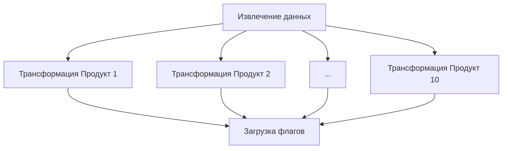

[RU-version](https://github.com/Halacky/eng_data_airflow/blob/main/README-ru.md)

[EN-version](https://github.com/Halacky/eng_data_airflow/blob/main/README-en.md)

# ETL-процесс для флагов активности клиентов в Apache Airflow

## Обзор проекта 📊

Этот проект реализует автоматизированный ETL-пайплайн для расчета показателей активности клиентов на основе данных о транзакциях с использованием Apache Airflow. Решение предоставляет ежемесячные данные о взаимодействии клиентов с 10 различными продуктами.

### Ключевые особенности ✨
- **Автоматическая ежемесячная обработка** (запуск 5-го числа каждого месяца)
- **Параллельная обработка продуктов** для оптимальной производительности
- **Инкрементальное обновление данных** с сохранением истории
- **Наглядные индикаторы** статуса активности клиентов

## Техническая реализация 🛠️

### Архитектура пайплайна


### Поток данных
1. **Извлечение** (из CSV) → 2. **Трансформация** (расчет активности) → 3. **Загрузка** (в CSV)

## Начало работы 🚀

### Требования
- Установленные Docker и Docker Compose
- 4ГБ+ свободной памяти для контейнеров

### Установка
```bash
# Инициализация окружения и запуск сервисов
./init.sh
```

### Доступ к Airflow
🌐 Откройте в браузере: [http://localhost:8080](http://localhost:8080)

🔑 Данные для входа:
- Логин: `admin`
- Пароль: (смотрите вывод терминала после init.sh или файл .env)

## Детали пайплайна 🔍

### Расписание выполнения
- Автоматический запуск: **Ежемесячно 5-го числа**
- Ручной запуск: Доступен через веб-интерфейс Airflow

### Задачи пайплайна
| Название задачи | Описание | Параллелизм |
|-----------------|----------|-------------|
| `extract_data` | Чтение исходных CSV-данных | Последовательный |
| `transform_{product}` | Расчет флагов активности за 3 месяца | Параллельный (10 задач) |
| `load_flags` | Объединение результатов в выходной файл | Последовательный |

## Расширенные возможности 🚀
- **Инкрементальная обработка**: Только добавляет новые записи без перезаписи истории
- **Оптимизация ресурсов**: Параллельная обработка сокращает общее время выполнения
- **Целостность данных**: Сохраняет полную историю статусов активности клиентов

## Мониторинг и результаты 📈
Интерфейс Airflow предоставляет мониторинг выполнения пайплайна в реальном времени:


Результаты сохраняются в `flags_activity.csv` со столбцами:
- ID клиента
- Месяц-Год
- Флаги активности по продуктам 1-10 (1=активен, 0=неактивен)

## Поддержка и устранение неисправностей 🛠️
Для получения помощи проверьте:
- Логи контейнеров: `docker-compose logs -f`
- Логи задач в интерфейсе Airflow
- Права на запись CSV-файлов при ошибках

---
